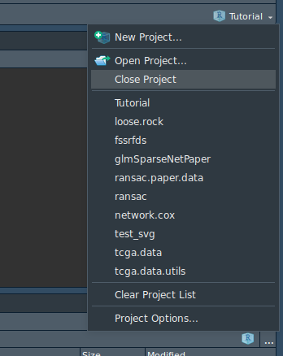

Introduction to R
================

-   [R Studio](#r-studio)
-   [Good practices in R](#good-practices-in-r)
    -   [Organization](#organization)
        -   [Projects](#projects)
        -   [Packages](#packages)
    -   [R Markdown](#r-markdown)
    -   [Tidyverse](#tidyverse)
    -   [ggplot2 *(part of tidyverse)*](#ggplot2-part-of-tidyverse)

R Studio
--------

Local version in your computer: [download here](https://www.rstudio.com/products/rstudio/download/#download)

Remote server: There's is also a remote interface in the group, see <https://sels.tecnico.ulisboa.pt/rstudio>

The interface both in the local and remote server are nearly identical, an example in the image below.


Good practices in R
-------------------

See **R for Data Science**: <https://r4ds.had.co.nz/index.html>

### Organization

#### Projects

Always use a project to separate the different contexts. It keeps the files and environment variables separated.

> File -&gt; New Project...

or use the shortcut at the top right corner of the R Studio interface



#### Packages

When creating a new project you can choose to create an R package, which automatically creates all the necessary files and folders.

**How is this better than me just having the files separated my own project or directory?**

A: This forces you to have a good organization and have better chances of having reproducable code.

-   keep all functions in the `/R` folder
-   keep all rmarkdown reports the `/vignettes` folder
-   keep all data in the `/data` folder

To load all functions instead of having to do `source('...')` to every file with an `.R` extension, you just need to load the package `devtools::load_all('.')` and loads all scripts in `/R` folder.

To save a given dataset you just need to do: `usethis::use_data(sample_data)` and it saves it the `data/` folder. To load the dataset, you just do `load(sample_data)` after loading the package.

### R Markdown

**Analyze. Share. Reproduce.**

> Your data tells a story. Tell it with R Markdown. Turn your analyses into high quality documents, reports, presentations and dashboards.

This document is generated with rmarkdown!!

**Tutorial**: <https://r4ds.had.co.nz/r-markdown.html>

**Cheatsheet**: <https://www.rstudio.com/wp-content/uploads/2016/03/rmarkdown-cheatsheet-2.0.pdf>

### Tidyverse

Tidyverse page: <https://www.tidyverse.org/>

See stats 545 class on tidyverse: <http://stat545.com/Classroom/notes/cm005.nb.html>

Another good tutorial on data transformations: <https://r4ds.had.co.nz/transform.html>

The best example to showcase tidyverse is *dplyr*:

If you want to filter a table by different columns the code is rather redundant:

``` r
diamonds[diamonds$x == 0 & diamonds$y == 0 & diamonds$z == 0, ]

# or

subset(diamonds, x == 0 & y == 0 & z == 0)

# instead with dplyr library

diamonds %>%
    filter(x == 0 & y == 0, z == 0)
```

The `%>%` operator allows you to cascade function calls and have an improved code.

It feeds the output of what is behind it to the next function *(thus, it's not necessary to explicitly write the first argument)*, so `sum(scale(1:10), na.rm = FALSE)` would be `scale(1:10) %>% sum(na.rm = FALSE)`

For instance if you want to filter, then sort by carat, then show only two specific columns, a solution with *dplyr* would be:

``` r
diamonds %>%
    filter(x == 0 & y == 0, z == 0) %>%
    arrange(carat) %>%
    select(carat, cut)
```

### ggplot2 *(part of tidyverse)*

*ggplot2* is a very powerful tool to generate graphics, it's also a bit complicated.

**Tutorial**: <https://r4ds.had.co.nz/data-visualisation.html>

**Cheatsheet** (very important!!): <https://www.rstudio.com/wp-content/uploads/2015/03/ggplot2-cheatsheet.pdf>
