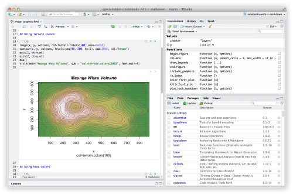
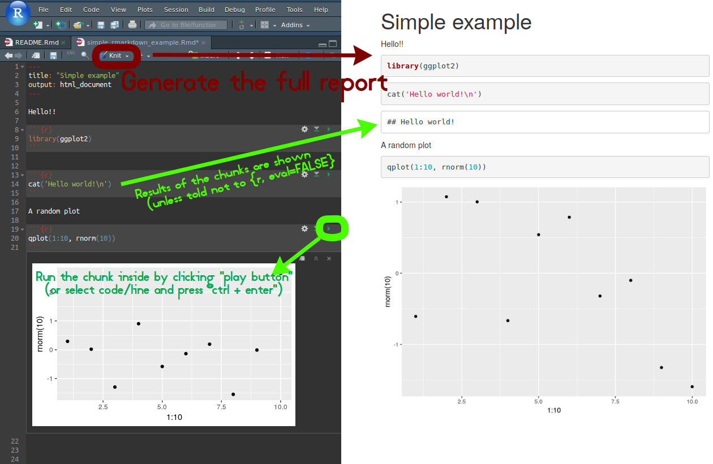

Introduction to R
================

-   [R Studio](#r-studio)
-   [Good practices in R](#good-practices-in-r)
    -   [Code organization](#code-organization)
        -   [Projects](#projects)
        -   [Packages](#packages)
    -   [R Markdown](#r-markdown)
    -   [Tidyverse](#tidyverse)
    -   [ggplot2 *(part of tidyverse)*](#ggplot2-part-of-tidyverse)

R Studio
--------

This is a very useful interface for R programming language, allowing to manage files, code, reports, packages in a single user friendly interface.



You can install locally on your computer ([download here](https://www.rstudio.com/products/rstudio/download/#download)), but **it is also avaliable on our lab's server** at <https://sels.tecnico.ulisboa.pt/rstudio>

The interface is the same, just web-based and running on a more powerful machine. Please ask for user credentials.

Good practices in R
-------------------

There's a very good book on **R for Data Science** that introduces many of the concepts in R for data manipulation and presentation.

The full online tutorial is available at <https://r4ds.had.co.nz/index.html>

In particular, there are three tutorials that standout:

1.  **Markdown**: allows to generate reports using R code chunks
    -   <https://r4ds.had.co.nz/r-markdown.html>
2.  **Data visualization** using ggplot2 package
    -   <https://r4ds.had.co.nz/data-visualisation.html>
3.  **Manipulation of data** using a clean syntax.
    -   <https://r4ds.had.co.nz/transform.html>

### Code organization

Having a good code organization is important in long running projects and for an easier reproducibility of your work.

An example of such is to separate independent work between folders and break the code in separate files, such as function in scripts *(files with an `.R` extension)* and reports *(files with an `.Rmd` extension)*.

`source('path/to/file')` is often used to load or reuse the code. I *(André)* would recommend using a package to better organize the code and reusability of the code.

**Important** Please use on of either options below, projects or package, as keeping all your files in the home directory and working in that environment will lead to problems down the line.

#### Projects

This feature of R Studio is used to separate different contexts. It keeps files and environment variables separated.

To create a new project you can use the menu:

> File -&gt; New Project...

or use the shortcut at the top right corner of the R Studio interface to create new projects or switch between available ones.

Even if you only have on task it's better to keep it inside a single project, as this creates a directory and the same base path for all files in that project.

#### Packages

As a more powerful alternative for projects, you can work from an skeloton R package.

When creating a new project you can choose to create an *R package* instead of an *empty new project*, which automatically creates all the necessary files and folders for having a working package.

*Tip*: after creating the R Package, run the command `devtools::use_vignette('vignette.Rmd')` to create the vignette folders and your first report/vignette.

**How is this better than me just having the files separated my own project or directory?**

A: This forces you to have a good organization and have better chances of having reproducible code.

-   keep all functions in the `/R` folder
-   keep all rmarkdown reports the `/vignettes` folder
-   keep all data in the `/data` folder

To load all functions instead of having to do `source('...')` to every file with an `.R` extension, you just need to load the package `devtools::load_all('.')` and loads all scripts in `/R` folder.

To save a given dataset you just need to do: `usethis::use_data(sample_data)` and it saves it the `data/` folder. To load the dataset, you just do `load(sample_data)` after loading the package.

**Beginner's tip**: If you get confused with this, remember just the two concepts below and you're good to go!

-   code under `/R` directory
-   vignettes under `/vignettes` directory and use `devtools::load_all('.')` to load all functions and data!

### R Markdown

**Analyze. Share. Reproduce.**

> Your data tells a story. Tell it with R Markdown. Turn your analyses into high quality documents, reports, presentations and dashboards.

**Tutorial**: <https://r4ds.had.co.nz/r-markdown.html>

**Cheatsheet**: <https://www.rstudio.com/wp-content/uploads/2016/03/rmarkdown-cheatsheet-2.0.pdf>

*Tip*: This document is generated with rmarkdown!!

Some of the benefits of using R Markdown as reports/visualization instead of scripts:

-   Easier to read and to tell a history
-   Results of running code are displayed just below the same chunk of code
    -   There should be a chunk of code for each result you want to show
-   Combine with some text giving context to the experiment
    -   Everything outside the chunks of code are just text that is displayed in the report
-   Generate an actual document to show the results, or multiple reports with different parameters

Simple example of an R Markdown



*Pro tip*: add to the header a param attribute and use it as global variables for the report. They are very useful as general parameters for the experiment.

    ---
    title: "Introduction to R"
    output: github_document
    params:
        alpha: 0.4
        nreps: 100
    ---
            
    ```r
    myfun(param$alpha, params$nreps)
    ```

### Tidyverse

**Tidyverse page**: <https://www.tidyverse.org/>

**Tutorial on data transformations**: <https://r4ds.had.co.nz/transform.html>

**Cheatsheet**: <https://www.rstudio.com/wp-content/uploads/2015/02/data-wrangling-cheatsheet.pdf>

The best example to showcase tidyverse is *dplyr*:

If you want to filter a table by different columns the code is rather redundant:

``` r
diamonds[diamonds$x == 0 & diamonds$y == 0 & diamonds$z == 0, ]

# or

subset(diamonds, x == 0 & y == 0 & z == 0)

# instead with dplyr library

diamonds %>%
    filter(x == 0 & y == 0, z == 0)
```

The `%>%` operator allows you to cascade function calls and have an improved code.

It feeds the output of what is behind it to the next function *(thus, it's not necessary to explicitly write the first argument)*, so `sum(scale(1:10), na.rm = FALSE)` would be `scale(1:10) %>% sum(na.rm = FALSE)`

For instance if you want to filter, then sort by carat, then show only two specific columns, a solution with *dplyr* would be:

``` r
diamonds %>%
    filter(x == 0 & y == 0, z == 0) %>%
    arrange(carat) %>%
    select(carat, cut)
```

### ggplot2 *(part of tidyverse)*

*ggplot2* is a very powerful tool to generate graphics, it's also a bit complicated.

**Tutorial**: <https://r4ds.had.co.nz/data-visualisation.html>

**Cheatsheet** (very important!!): <https://www.rstudio.com/wp-content/uploads/2015/03/ggplot2-cheatsheet.pdf>
